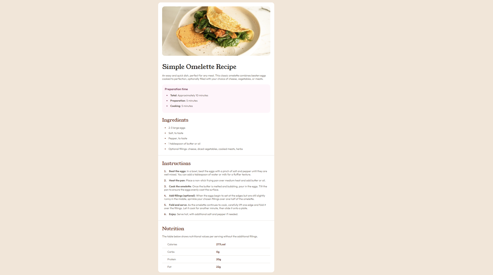

# Frontend Mentor - QR code component solution

This is a solution to the [QR code component challenge on Frontend Mentor](https://www.frontendmentor.io/challenges/qr-code-component-iux_sIO_H). Frontend Mentor challenges help you improve your coding skills by building realistic projects. 

## Table of contents

- [Overview](#overview)
  - [Screenshot](#screenshot)
  - [Links](#links)
- [My process](#my-process)
  - [Built with](#built-with)
  - [What I learned](#what-i-learned)
  - [Continued development](#continued-development)
  - [Useful resources](#useful-resources)
- [Author](#author)

## Overview

### Screenshot

### Links

- Solution URL: [Solution](https://github.com/RedaKaafarani1/QRCode)
- Live Site URL: [Live website](https://redakaafarani1.github.io/QRCode/)

## My process

### Built with

- HTML5
- CSS
- Flexbox

### What I learned

I reinforced what I have been learning in HTML and CSS for a week now. I don't think this is a very optimal way of achieving the result but it gets the job done!

### Continued development

I still need to focus on different points:
- Understanding the different positioning in CSS
- writing optimal CSS code without doing hacky methods to achieve the result

### Useful resources

- [Youtube HTML and CSS project](https://www.youtube.com/watch?v=np3L1lb-Uvs&list=PLImJ3umGjxdD3ov2lwg0SM5rxz5v9FjOf) - This helped me in shaping the HTML file as well as understanding many concepts of CSS and how it works in conjunction with HTML

## Author

- Website - [Reda](https://github.com/RedaKaafarani1)
- Frontend Mentor - [@RedaKaafarani1](https://www.frontendmentor.io/profile/RedaKaafarani1)
